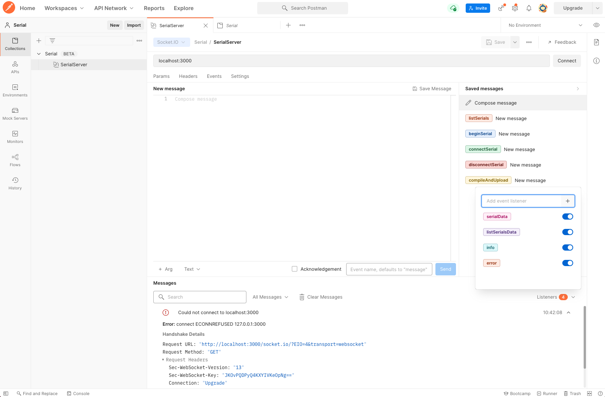

# Arduino Server

A simple server that allows to compile and upload sketches on Arduino via socket.io, as well as to listen to serial output.

## Overview

Please refer to the docs folder about the available operations. These include:

**PUB**

- listSerials
- beginSerial
- connectSerial
- disconnectSerial
- compileAndUpload

**SUB**

- listSerialsData
- serialData
- info
- error



## Client side example

```js
import io from 'socket.io-client';
const socket = io('http://localhost:3000', {
  reconnection: true,
});

socket.on('connect', function () {
  console.log('Connected!');
  socket.emit('listSerials');
});

socket.on('listSerialsData', function (ports: string[]) {
  console.log(ports);
});
```
